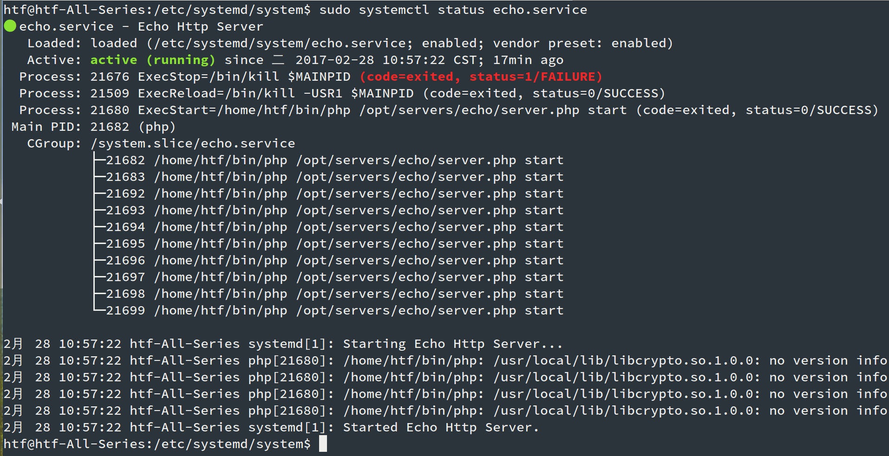

# 使用systemd管理swoole服务 

Systemd 是 Linux 系统中新一代的初始化系统（init），它主要的设计目标是克服 sysvinit 固有的缺点，提高系统的启动速度。很多新的Linux发行版已经使用Systemd取代了init，作为初始守护进程。

Swoole的服务器程序可以编写一段service脚本，交由systemd进行管理。实现故障重启、开机自启动等功能。

## 编写Service脚本

Systemd的Service配置在/etc/systemd/system/目录中，可以创建一个echo.service文件，实际项目应当改为对应的名称。编辑此文件，添加下列内容：

```
[Unit]
Description=Echo Http Server
After=network.target
After=syslog.target

[Service]
Type=forking
PIDFile=/opt/servers/echo/server.pid
ExecStart=/home/htf/bin/php /opt/servers/echo/server.php
ExecStop=/bin/kill $MAINPID
ExecReload=/bin/kill -USR1 $MAINPID
Restart=always

[Install]
WantedBy=multi-user.target graphical.target
```

- `After` 指令约定了启动的顺序，必须在network和syslog启动后才启动echo服务
- `Service` 中填写了应用程序的路径信息，请修改为实际项目对应的路径
- `Restart=always` 表示如果进程挂掉会自动拉起
- `WantedBy` 约定了在哪些环境下启动，`multi-user.target graphical.target`表示在图形界面和命令行环境都会启动

编写完成后需要reload守护进程使其生效

```
sudo systemctl --system daemon-reload
```

## 程序代码

```
$http = new swoole_http_server("0.0.0.0", 9501);

$http->set([
    'daemonize' => true,
    'pid_file' => __DIR__.'/server.pid',
]);

$http->on('request', function ($request, $response) {
    $response->header("Content-Type", "text/html; charset=utf-8");
    $response->end("<h1>Hello Swoole. #".rand(1000, 9999)."</h1>");
});

$http->start();
```

- daemonize 表示启动为守护进程（必选）
- pid_file 表示生成PID文件（必选）

## 管理服务

```
#启动服务
sudo systemctl start echo.service
#reload服务
sudo systemctl reload echo.service
#关闭服务
sudo systemctl stop echo.service
查看服务状态
sudo systemctl status echo.service
```


